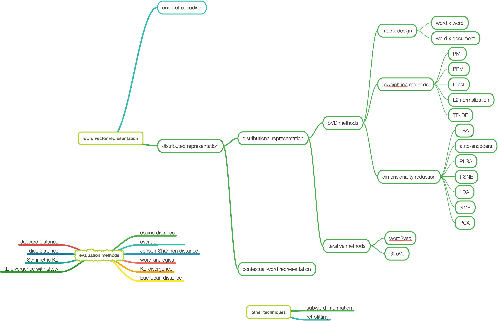

## Distributed Representations

This module explores techniques for building distributed representations - vectors that encode the meanings of linguistic units.
It focuses mainly on distributional representations - the special case where data come entirely from co-occurrences counts in corpora.
The resulting models are called vector space models (VSMs).
Topics presented include the following:
1.  Matrix Design Techniques: co-occurrences count between the lexical items and linguistic contexts.
2.  Reweighting Schemes: techniques used to amplify the important, the trustworthy, the unusual information; and deemphasize the mundane and the quirky information.
3.  Dimensionality reduction: techniques used to reduce the dimensions of the vector space model
4.  Vector Comparison: methods for assessing the VSM
5.  Subword Information or Subword Modeling: techniques used to enrich the VSM using character-level n-grams models.
6.  Visualization: techniques used to visualize the VSM
7.  Retrofitting: methods used to enrich the VSM using semantic lexicons.

